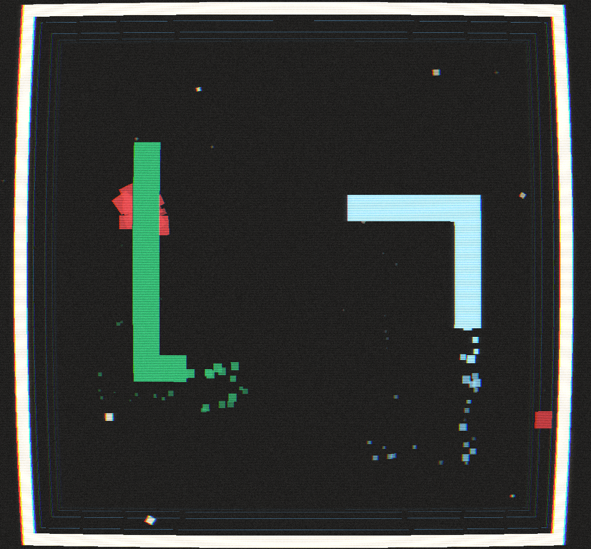
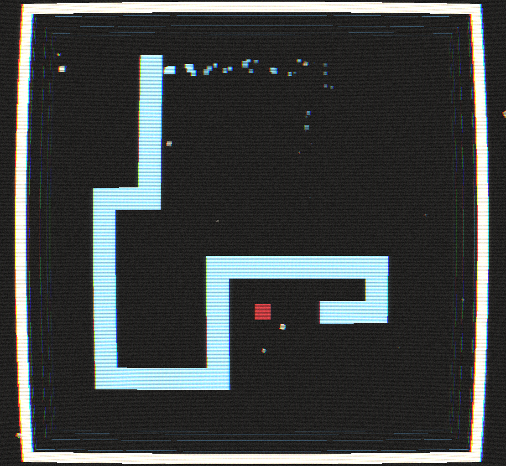

# Rosario - Devlog - 1

## Table of Contents
1. [It Was Just a Phase](#11---it-was-just-a-phase)
2. [Back to the Cocoon (Which Would Make More Sense if the Main Entity of the Game Was a Worm Instead of a Snake, But You Get the Idea)](#12-back-to-the-cocoon-which-would-make-more-sense-if-the-main-entity-of-the-game-was-a-worm-instead-of-a-snake-but-you-get-the-idea)
3. [The Snake and the Mouse](#13-the-snake-and-the-mouse)
4. [It's Not a Sword, It's a Key!](#14-its-not-a-sword-its-a-key)
5. [Tearing My Screen Appart](#145-tearing-my-screen-appart)
6. [Pre, Peri and Post processing](#16-pre-peri-and-post-processing)
7. [Hello From the GPU Side](#17-hello-from-the-gpu-side)
8. [The Two Dimension Comeback](#18-the-two-dimension-comeback)


<br>
<br>

>*Coming back from way, way down the bottom of this document to have you bare in mind that this is a L O N G devlog. Sorry.*

# 1.1 - It Was Just a Phase
Here we are, on the other side of what has been tagged as `V1`. Today the two week sprint towards a more mechanically complex, raylib-unified, *snake* based game start, which means that we're having **R E F A C T O R I N G**  for breakfast, lunch and dinner. I've been in this position before, having to plan and layout carefully thought steps to scale *down* a build so that a new development process can start anew from a compact, controlled state of things. Personally, I still find this situations a bit overwhelming, mostly because after spending so much time writing a game that builds and launches and works and doesn't break and explode into pieces, taking it appart feels like playing a risky game of *Jenga*. Or maybe the analogy is not quite precise, because once you take out one piece the whole thing collapses and the next hours are comprised of a mixture of "might as well keep getting all the stuff I think should be out of the new starting point" and "how can I make this compile again for the love of everything sacred". I've being a little overdramatic, I know (must say that if you've arrived to this log after going through all the development journaling done for `V1`, you already know the extent of my dramatism), but it can get tyring. Theres a counterpoint, of course, the same one that's always looming in any programming journey: nothing works until it works, and when it works life becomes wonderful. So, yeah:
- today's first task is **scaling down and stripping the project of what has become dead weight under the banner of `V2`**
- then, a new build pipeline and some refactoring in the surviving code needs to be done so that a raylib-based game persists
- after which, some porting needs to be done, specially regarding `SDL` stuff
    - for now, I want what was the `SDL` menu in `V1` to be the main menu in `V2`, which entrails adding a `2D` rendering mode/pipeline
    - this means that the particle system, which was tied exclusively to `SDL`, needs to be ported to `Raylib`
- we'll end with a general check, a test suite reconfigration to adapt it in the new `Makefile` and a new, fresh starting point.

If everything goes right, at the end of today there will be a **raylib-exclusive *nibbler* build with the SDL starting menu and gameover and a recovered gtest suite**. If not... doesn't matter, because we will **S U C C E E D**.

> *The good news is that scaling down means also simplifying, which brings solace to the soul. Soulace, if you will.*

<br>
<br>

# 1.2. Back to the Cocoon (Which Would Make More Sense if the Main Entity of the Game Was a Worm Instead of a Snake, But You Get the Idea)
On second thought, it wouldn't even make that much sense if it was a worm. If it was a butterfly, going *back* to the cocoon would totally make sense, but worm would go *foward* to a cocoon. Uhm, anyway, here's a list of things that we're going to lose along the way:
- Anything `SDL` and `NCurses` related
- The graphic interfacing (no longer needed in the new monolibrary approach)
- Any audio related stuff (will rebuild audio inside `Raylib`)

All of this with the consequential changes each removal has in the code. Once done, a new `Makefile` will be written, and we *should* be good... And we are!! If you go through the codebase, you'll see that we're now `Raylib` exclusive and that the game builds and runs smoothly. Yay!

The more tricky part is what comes next, the porting of some `SDL` stuff into Raylib. We'll need a couple of things:
- A 2D-camera based rendering pipeline
- A rewriting of the `ParticleSystem` and the `menu`/`gameover` renderings into `Raylib`
- A general reorganization of the directory structure, some renaming, that kind of managing work...

After some work, I've arrived to a new base build for `V2`, a combination of what was already in place for the `Raylib` version in `V1` with the menuing of `SDL`. Making this work was a hustle, but the byproduct is that I now have implemented a `2D` rendering pipeline alongisde the existing `3D` one, which is nice progress. I've also divided the `srcs` directory intro `AI`, `core` and `graphics`, and will move on from here with a system-based approach in mind. This might mean some more refactorization, as the current division between `Renderer`, `TextRenderer` and `TitleHandler` feels a little bit wonky, but we'll see. 

Be what it may, what I'd like to do with the rest of the day, now that a lot of porting and refactoring is behind me, is work in some new implementations (the **I R K***). Some things in my immediate list:
- A clickable button system for menuing
- A general menu system that handles start, pause and gameover screens
- A systematized pipeline to write stuff in the likes of the current game logo

BUT as I lay out plans, I realize something: I need a deep re-structuring process. The current build is quite messy: there are nested systems that are general-purpose, subsystems that need to be decoupled, uncertainty regardin ownership... So the priority shifts that way. Before we move on, there needs to be a refactoring so that **`Main` owns all systems and calls their update methods in the game loop depending on the state of the game**. And the initial system configuration is comprised of:

- [x] Renderer
- [x] Game controller
- [x] Particle system
- [x] Text system
- [x] Animation System
- [x] Menu system
- [x] InputManager
- [x] Postprocessing System
- [ ] Custom text system/pipeline/subsystem
- [x] *Fix the test suite (and extend it)*
- [x] *Port the 2D realm*
- [ ] *Port the ASCII realm (maybe)*

Inter-system communication will be laid out by passing references. If things get too complicated down the line, which I doubt but who am I to say, I'll transition into an event system with connecting lambda functions. I'll get into system rebuild mode. Wish me luck.

## 1.3 The Snake and the Mouse
Let's implement buttons. First, I will disable the keyboard based inputs, as those should be rewritten later to follow the selection of the mouse, i.e., the mouse will leave a selected button once a hovering event is detected, and from there the keyboard will be enabled to move along the menu. Everything regarding a menu will be reworked into a new `MenuSystem`, which will home a new `Button` class and will track it's own state to know if it should render the start menu, the pause options, the gameover screen, etc. This means both creating a new systen and decoupling a substantial amount of managing code that is spread in other parts of the game, like the input handling in the main game loop (although, when keyboard input is recovered the keyhooks might return there; either that or maybe decouple all input into an `InputManager`), and the menu rendering calls in the general `Renderer` system. And after some work, this is the result:
```cpp
struct Button {
    Rectangle bounds;
    std::string Text;

    Color outlineColor;
    Color backgroundColor;
    Color textColor;
    Color hoverColor;
    Color textHoverColor;
    Color outlineHoverColor;

    float outlineWidth = 5.0f;

    std::function<void()> onClick;

    bool isHovered(Vector2 mousePos) const {
        return CheckCollisionPointRec(mousePos, bounds);
    }

    void render(bool hovered) const {
        Color currentColor = hovered ? hoverColor : backgroundColor;
        Color currentTextColor = hovered ? textHoverColor : textColor;
        Color currentOutlineColor = hovered ? outlineHoverColor : outlineColor;
        DrawRectangleRec(bounds, currentColor);
        DrawRectangleLinesEx(bounds, outlineWidth, currentOutlineColor);
        Vector2 textSize = MeasureTextEx(GetFontDefault(), Text.c_str(), 20, 1.0f);
        Vector2 textPos = {
            bounds.x + (bounds.width - textSize.x) / 2,
            bounds.y + (bounds.height - textSize.y) / 2
        };
        DrawTextEx(GetFontDefault(), Text.c_str(), textPos, 20, 1.0f, currentTextColor);
    }
};
```

```cpp
enum class MenuState {
	Start,
	Paused,
	GameOver,
	Options
};

class MenuSystem {
	private:
		GameController &gameController;
		MenuState currentState;
		std::vector<Button> buttons;

		// menu specific particle states
		float particleSpawnTimer;
		const float particleSpawnInterval = 0.15f;
		int logoSnakeTrailCounter;

		// cached screen dimensions
		int screenWidth;
		int screenHeight;

		//helpers
		void spawnMenuParticles(float deltatime, ParticleSystem& particles);
		void initializeButtons();
		void clearButtons();

	
	public:
		MenuSystem(GameController &gameController);;
		~MenuSystem() = default;

		void init(int width, int height);
		void setState(MenuState newStat);
		MenuState getstate() const { return currentState; }

		// update and render for each menu state
		void update(float deltaTime, ParticleSystem& particles, AnimationSystem& animations);
		void render(Renderer3D &renderer3D, TextSystem& textSystem,
					ParticleSystem& particles, AnimationSystem& animations,
					const GameState& state);
		void renderGameOver(Renderer3D &renderer3D, TextSystem& textSystem,
							ParticleSystem& particles, AnimationSystem& animations,
							const GameState& state);
		void handleInput(Vector2 mousePos, bool mouseClicked);
		Button* getHoveredButton(Vector2 mousePos) const;

		// button functions
		void startGame();
		void switchConfigMode();
		void restartGame();
		void quitGame();
};
```

> For definition of the menu system, go to its cpp file. Also, some stuff is missing at this time, like the pause menu rendering, as that screen/menu is not yet worked.

The general work of the new mouse navigation its not complex. Buttons are rendered via `Raylib` drawing functions to make different kinds of rectangles, and their display changes based on a simple hovering detection to add some basic flair. The handling of the *click* itself is still in `Main`, inside the loop, as the possibility of a `InputManager` is still that, a possibility, but the rest of the necessary managment is on the side of the `MenuSystem` + `Button` combination. `Raylib` gives quite an easy pipeline to manage this:
- `CheckCollisionPointRec(Vector2 point, Rectangle rec)` compares the coordinates of the mouse pointer against a premade rectangle object
- `IsMouseButtonPressed(int button);` is the basic hook for mouse buttons.

Combine these and **a hovering based mouse input management** can easily be coded. The buttons just need an attacked `onClick()` function that is tied to an `std::function`, which is set up during button initialization via lamba-based calls to premade input handling methods and the transition to mouse navigation is done. Everything works, but (BUT) the input handling feels wrong. So, you guessed it right, it's decision making time: let's add another system for input management!

<br>
<br>

## 1.4. It's Not a Sword, It's a Key!
In my mind, this is a quote from *Kingdom Hearts*. If it's not, it surely could be, so I guess that's the point. *I's me, he says!*. Whatever, it has *key* in it and we're going to do keyboard related stuff so etc., let's design an all input encompasing manager. To build this new system, we'll need:
- Track the input context, so that different contexts can have different input outcomes
- Split the input processing in two ways: **navigation** and **gameplay**
- Track the mouse state (for convenience, mainly)

The main structural decision in the manager will be to build the `update()` function around a context check. Menu states will be handled through `NavigationAction`, Gameplay states through a specific polling function and Pause, which is not yet a menu, will be placeholded to work as it has been doing until now, as a set and unset integration. The key aspect here is that **buttons will be initialized with `onClick()` functions** and **keys will be tied to context-depending behaviours**. So, for example, the `W` key will work as an upwards navigation in a menu, cycling through buttons, but will move the secondary snake in the upwards direction during gameplay. Gameplay wise, the only thing that's changed is the place in which the polling is managed, but it is still called in main, it's just that it will be called now via the `InputManager`, then buffered in the `GameController`. Mouse related stuff will be handled via `updateMouseState()`, which refreshes the cursor's position and the state of the left and right mouse buttons, and stores the delta value since last update (not really used atm, but could be put to interesting interaction later, we'll see).

The trickiest part is how to connect what are now button tied, menu system contained functions to key callbacks. That's where `registerNavigationCallback()` and `registerMouseCallback()` come into play. This needs some lambda magic, as well as some changes in the menu system itself, which has gone from a single `handleInput()` function to a two pipeline handling, made up of `handleNavigation()` and `handleMouseInput()`:
```cpp
InputManager inputManager;
	inputManager.registerNavigationCallback([&menu](NavigationAction action) {
    	menu.handleNavigation(action);
	});
	inputManager.registerMouseCallback([&menu](Vector2 pos, bool clicked) {
		menu.handleMouseInput(pos, clicked);
	});
```
Now, how this works needs its own subsection. Or, really, I am the one who needs it >_>

### 1.4.1. Lambda Juggling: A Breakdown of the Callback System (Because I Spent Too Long Understanding This)

Okay, so here's the thing: I spent a good chunk of time trying to write a lambda/callback setup and wrapping my head around how the hell could I make `InputManager` talk to `MenuSystem` without directly knowing about it. I've already written code like this, but it's still something that I have't mastered, one of those things that makes perfect sense once you get it, but until then it feels like arcane powers. So let me break it down for future me (and anyone else who needs it):

#### **The Problem**

The `InputManager` needs to tell the `MenuSystem` about input events (like "user pressed Up" or "user clicked the mouse"), but we DON'T want `InputManager` to directly depend on `MenuSystem`. Why? Because then `InputManager` becomes a mess if we ever want to add a `PauseMenu` or `OptionsMenu` or whatever. We want `InputManager` to be independent, it just needs to know that "input happened" and to tell it to *someone*, *somewhere*.

#### **The Lambda Solution**

Let's dissect this monstrosity:

```cpp
inputManager.registerNavigationCallback([&menu](NavigationAction action) {
    menu.handleNavigation(action);
});
```

**What's happening here?**

1. **`registerNavigationCallback(...)`** is a function in `InputManager` that takes a `std::function<void(NavigationAction)>` as a parameter. In plain English: "Give me a function that takes a `NavigationAction` and returns nothing."

2. **`[&menu]`** is the **capture clause** of the lambda. This is where the magic happens. It's saying: "Hey lambda, you need to *remember* the `menu` object from the surrounding scope, and keep a reference to it (`&`)." Without this, the lambda wouldn't know what `menu` is when it gets called later.

3. **`(NavigationAction action)`** is the lambda's parameter list. When this lambda eventually gets called (by `InputManager`), it will receive a `NavigationAction` value (like `NavigationAction::Up` or `NavigationAction::Confirm`).

4. **`menu.handleNavigation(action);`** is the lambda's body. This is what actually happens when the lambda executes: it takes the `action` it received and forwards it to the `menu` object's `handleNavigation()` method.

#### **The Flow: How It All Connects**

Here's the journey of a keypress from hardware to menu action:

```
┌─────────────────────────────────────────────────────────────────┐
│ 1. USER PRESSES "UP" KEY                                        │
└─────────────────────────────────────────────────────────────────┘
                              ↓
┌─────────────────────────────────────────────────────────────────┐
│ 2. InputManager::update() detects the keypress                  │
│    - Checks keyboardMappings[NavigationAction::Up] == KEY_UP    │
│    - Sees that IsKeyPressed(KEY_UP) is true                     │
└─────────────────────────────────────────────────────────────────┘
                              ↓
┌─────────────────────────────────────────────────────────────────┐
│ 3. InputManager calls: onNavigation(NavigationAction::Up)       │
│    - onNavigation is a std::function member variable            │
│    - It was SET during registration in main.cpp                 │
└─────────────────────────────────────────────────────────────────┘
                              ↓
┌─────────────────────────────────────────────────────────────────┐
│ 4. The LAMBDA executes (the one we registered in main.cpp)      │
│    - Lambda receives: action = NavigationAction::Up             │
│    - Lambda has captured reference to 'menu' object             │
│    - Lambda executes its body: menu.handleNavigation(action)    │
└─────────────────────────────────────────────────────────────────┘
                              ↓
┌─────────────────────────────────────────────────────────────────┐
│ 5. MenuSystem::handleNavigation(NavigationAction::Up) runs      │
│    - Switches on the action                                     │
│    - Calls selectPreviousButton()                               │
│    - Button selection changes!                                  │
└─────────────────────────────────────────────────────────────────┘
```

#### **The Storage: How the Lambda Lives**

Inside `InputManager`, we have:

```cpp
std::function<void(NavigationAction)> onNavigation;
std::function<void(Vector2, bool)> onMouseInput;
```

These are **member variables** that store function objects. When we call `registerNavigationCallback()`, we're doing this:

```cpp
void InputManager::registerNavigationCallback(std::function<void(NavigationAction)> callback) {
    onNavigation = callback;  // Store the lambda for later!
}
```

So the lambda we created in `main.cpp` gets **copied into** the `onNavigation` member variable. It lives there, with its captured `&menu` reference intact, waiting to be called.

Later, in `InputManager::update()`, when we detect input:

```cpp
if (IsKeyPressed(key)) {
    if (onNavigation) {  // Check if a callback was registered
        onNavigation(action);  // CALL THE STORED LAMBDA!
    }
}
```

#### **The Mouse Case**

```cpp
inputManager.registerMouseCallback([&menu](Vector2 pos, bool clicked) {
    menu.handleMouseInput(pos, clicked);
});
```

Same pattern:
- Lambda captures `&menu` reference
- Takes two parameters: `Vector2 pos` and `bool clicked`
- Forwards them to `menu.handleMouseInput(pos, clicked)`
- Gets stored in `onMouseInput` member variable
- Called in `InputManager::update()` when mouse state changes

#### **The Capture Clause: Why `&menu` and Not `menu`?**

This tripped me up for a bit. The difference:

- **`[menu]`** (capture by value): Makes a COPY of the menu object. Bad idea — menu is huge, and we'd be copying it every time.
- **`[&menu]`** (capture by reference): Stores a REFERENCE to the original menu object. Lightweight and correct.

The only danger with `[&menu]` is if the `menu` object gets destroyed before the lambda is called. But in our case, `menu` lives for the entire program lifetime in `main()`, so we're safe.

#### **A Simplified Explanation If (IF!!! NEVER WHEN!!!) I Forget This**

1. We create a lambda in `main.cpp` that captures a reference to `menu`
2. We pass that lambda to `InputManager` via `register*Callback()`
3. `InputManager` stores it in a `std::function` member variable
4. When input happens, `InputManager` calls the stored lambda
5. The lambda forwards the input to `menu.handleNavigation()` or `menu.handleMouseInput()`
6. Menu does its thing

**IN EVEN SIMPLER, EVEN MORE HUMAN, PERHAPS EVEN MORE UNDERSTANDABLE TERMS:**
- InputManager has a couple of function attributes that at some point need to be defined. These are onNavigation and onMouseInput
- The moment in which they are defined is right after instantiating the InputSystem in main, and they're astored via the two callback registration functions that the InputManager also has. These registration functions take functions as arguments and store them in the attributes stated in the last point.
- The definition itself is done via lambda functions, right in place, and these lambda functions in main take a reference to menu and basically take some arguments and send them to the respective handling functions in menu.
- What this means is that after doing all of this, InputManager has a couple of function attributes that have the menu scope captured as reference, so when the InputManager update functon, context dependent, calls one of those functions and sends the captured input action (which is a power that only the InputManager has), everything is hoked up to communicate back to menu that this or that action happened.
- The rest is just the menu knowing what to do with the input sent back by the InputManager.

It's basically a **hand-wired event system** without needing a full event bus. The lambda acts as a **bridge** between the generic `InputManager` and the specific `MenuSystem`, letting them communicate without coupling them together.

> Maybe I should build an event bus/system? You tell me. Last time I built a game engine from scratch I did with an event pipeline, but it felt a little bit overdone, so I wanted to try a different approach here. We'll see if this decision bites my ass.

> The important point of all of this: INPUT MANAGER DONE!!
<br>
<br>

## 14.5 Tearing My Screen Appart
I've noticed something terrible while testing the new `V2` starting build: even though I launch the `Raylib` window with `Vsync` on, I'm having a horrible screen tearing effect. My best guess as to why is that there might be too many draw calls, so let's try to attack it from that front. The most likely culprit: too many calls to `BeginDrawing()-EndDrawing()`. Fixing this means rewriting the main game loop so that the `update` and the `rendering` phases are separated. 

### First Attempt: Unified Render Phase

The new loop separates update and render clearly:
```cpp
while (state.isRunning) {
		auto currentTime = std::chrono::high_resolution_clock::now();
		std::chrono::duration<float> frameTime = currentTime - lastTime;
		float deltaTime = frameTime.count();
		lastTime = currentTime;
		
		// update phase
		inputManager.update();
		
		switch (state.currentState) {
			case GameStateType::Menu: {
				gameOverStateInitialized = false;
				inputManager.setContext(InputContext::Menu);
				menu.update(deltaTime, particles, animations);
				break;
			}

			case GameStateType::Playing: {
				inputManager.setContext(InputContext::Gameplay);
            	Input input = inputManager.pollGameplayInput();
				
				if (input == Input::Pause) {
					state.isPaused = !state.isPaused;
					state.currentState = state.isPaused ? 
						GameStateType::Paused : GameStateType::Playing;
				}
			
				gameController.bufferInput(input);

				state.timing.accumulator += deltaTime;
				
				while (state.timing.accumulator >= FRAME_TIME) {
					gameController.update();
					state.timing.accumulator -= FRAME_TIME;
					
					if (!state.isRunning) {
						state.currentState = GameStateType::GameOver;
						state.isRunning = true;
						break;
					}
				}
				break;
			}
				
			case GameStateType::Paused:
				inputManager.setContext(InputContext::Paused);
				// No update needed while paused
				break;
				
			case GameStateType::GameOver: {
				if (!gameOverStateInitialized) {
					menu.setState(MenuState::GameOver);
					gameOverStateInitialized = true;
				}
				
				inputManager.setContext(InputContext::GameOver);
				particles.update(deltaTime);
				animations.updateTunnelEffect(deltaTime);
				break;
			}
		}
		
		//rendering phase
		BeginDrawing();
		ClearBackground(Color{23, 23, 23, 255});
		
		switch (state.currentState) {
			case GameStateType::Menu: {
				BeginMode2D((Camera2D){(Vector2){0.0f, 0.0f}, (Vector2){0.0f, 0.0f}, 0.0f, 1.0f});
				menu.render(renderer, textSystem, particles, animations, state);
				EndMode2D();
				break;
			}

			case GameStateType::Playing:
			case GameStateType::Paused: {
				// Update renderer state
				renderer.render(state, state.isPaused ? 0.0f : deltaTime);
				
				// 3D gameplay rendering (Paused uses same render, just frozen)
				BeginMode3D(renderer.getCamera());
				renderer.drawGroundPlane();
				renderer.drawSnake(state.snake_A, snakeAHidden, 
					snakeALightFront, snakeALightTop, snakeALightSide,
					snakeADarkFront, snakeADarkTop, snakeADarkSide);
				
				if (state.config.mode == GameMode::MULTI) {
					renderer.drawSnake(state.snake_B, snakeBHidden,
						snakeBLightFront, snakeBLightTop, snakeBLightSide,
						snakeBDarkFront, snakeBDarkTop, snakeBDarkSide);
				} else if (state.config.mode == GameMode::AI) {
					renderer.drawSnake(state.snake_B, snakeAIHidden,
						snakeAILightFront, snakeAILightTop, snakeAILightSide,
						snakeAIDarkFront, snakeAIDarkTop, snakeAIDarkSide);
				}
				
				renderer.drawFood(state.food);
				EndMode3D();
				
				// UI overlay
				DrawText("Press 1/2/3 to switch libraries", 10, 10, 20, customWhite);
				DrawText("Arrow keys to move, Q/ESC to quit", 10, 35, 20, customWhite);
				DrawFPS(screenWidth - 95, 10);
				
				if (state.isPaused) {
					DrawText("PAUSED", screenWidth / 2 - 60, screenHeight / 2, 40, customBlack);
				}
				
				// Post-processing
				renderer.drawNoiseGrain();
				break;
			}
				
			case GameStateType::GameOver: {
				BeginMode2D((Camera2D){(Vector2){0.0f, 0.0f}, (Vector2){0.0f, 0.0f}, 0.0f, 1.0f});
				menu.renderGameOver(renderer, textSystem, particles, animations, state);
				EndMode2D();
				// renderer.drawNoiseGrain(); // keeping noise for contrast in game over
				break;
			}
		}
		
		EndDrawing();
		
		std::this_thread::sleep_for(std::chrono::milliseconds(1));
	}
```

Aaaaand it didn't fix the tearing :D

Following the cliché, the first suspect is never the real culprit. But we have a second one: I've been dragging along a sleep call at the end of the main loop. It's been there since the multilibrary `V1` project because at some point during development I needed for... I don't even remember. Thing is it might have been messing up the refresh rate controlled by `Raylib`, so after getting it out from the loop... No more apparent tearing. C A S E  S O L V E D. I guess that millisecond was making the render thread hang for, well, a millisecond, causing a visual tear. Amazing stuff, really.

<br>
<br>

## 1.6 Pre, Peri and Post processing
Having restructured the code in a handful of (the usual) systems, I might as well take the postprocessing out of `Render` and take it into its own system. This will give me more autonomy regarding how the game looks at different states, and a true post processing pipeline will be easier to implement. So, before throwing ourselves into building this new system, and in case you are reading this while building your own engine or game and would like some basics on what postprocessing is and what are the foundations of any usual pipeline in this regard, let's spend some time talking about postprocessing in general.

**Postprocessing is**, generally speaking, **any visual effect applied AFTER a scene has rendered**. Kind of like applying **filters** to how the scene looks, so that the rendering phase gets refactored from a direct rendering-to-screen into a series of steps:
1. **Render the scene** → Everything that comprises the visual output of the game (Scene, UI, Particles). OR, the specific combination of stuff that you want to be affected by postprocessing, that is (for example, if you wanted to have a non-affected UI on top of your postprocessed image, you'd have to manage that in the drawing order, of course)
2. **Capture the output into a texture** →  Store what would usually be output to the screen in an image in memory
3. **Apply effects**→ (Post)Process the texture with the implemented shaders and filters
4. **Display the result** → Finally, show the (post)processed image on screen.

What this means for the new `PostprocessingSystem` that we want to build is that, although right now we just have a very basic, placeholder-testish noise effect in our postprocessing collection, what we need to build is this new 4-step pipeline. With that, we'll be able to start experimenting with effects and dig around for what feels *good* for the general aesthetics of this `V2` of our turbo *snake*. After some research, it looks like `Raylib` has excellent tools to make this process easy. The logic will be like the following:
- Create, during game initialization, a **screen size texture** that will be the target of the rendering.
- Instead of call `BeginDrawing()` directly, call first `BeginTextureMode()` with the initialized screen texture as target.
- THEN, call `BeginDrawing()` to postprocess the rendered texture, most likely by going through a prewritten shader, using `BeginShaderMode()`.
- REMEMBER, there needs to be an `UnloadRenderTexture()` call upon game exit, as is the case with any texture created during the game execution.

The shader part is really the complicated one. `Raylib` uses **GLSL Shaders**, which just means that they are `OpenGL` based shaders, which need to be written in a specific way (quite C-like). We'll get into them in a bit, but for now we have to lay out the postprocessing system, for which we'll need:
- An effect tracker/enum
- A config data struct
- Some shader attributes to store prewritten shaders
- A general rendering flow (begin, end and present the postprocessing pipeline)
- Togglers and knobs to control the effects and their intesity

All in all, we can start from here:
```cpp
enum class PostProcessEffect {
	None,
	CRT,
	Scanlines,
	Bloom,
	Vignette,
	ChromaticAberration,
	Grain
};

struct PostProcessConfig {
	bool enabled = true;
	std::vector<PostProcessEffect> effects;

	// CRT params
	float scanlineIntensity = 0.15f;
	float curvatureAmount = 0.08f;
	float vigentteStrength = 0.3f;
	float chromaticAberration = 0.005f;
	float bloomIntensity = 0.3f;
	float grainAmount = 0.02f;
};

class PostProcessingSystem {
	private:    
		RenderTexture2D renderTarget;
		RenderTexture2D bloomBuffer;

		Shader crtShader;
		Shader bloomShader;
		Shader compositeShader;

		PostProcessConfig config;

		int screenWidth;
		int screenHeight;
		float time;

		// Helpers
		void applyBloom();
		void applyCRT();
		void applyEffect(PostProcessEffect effect);

	public:
		PostProcessingSystem();
		~PostProcessingSystem();

		void init(int width, int height);
		void setConfig(const PostProcessConfig& config);

		// rendering flow
		void beginCapture();
		void endCapture();
		void applyAndPresent(float deltaTime);

		// presets
		static PostProcessConfig presetCRT();
		static PostProcessConfig presetClean();
		static PostProcessConfig presetMenu();

		// runtime control
		void toggleEffect(PostProcessEffect effect);
		void setEffectIntensity(PostProcessEffect effect, float intensity);

		RenderTexture2D& getRenderTarget() { return renderTarget; }
};
```

The CRT stuff included in this layout is just to test the pipeline. Once it is functioning we can move on to managing everything via GLSL shaders. The definition of the system is nothing to write home about, just some regular management (go to the cpp file to check it out in full). The key insight at this point is how to make the rendering pipeline go through this new post processing steps. In other words, time to change, once again, the main loop, specifically the rendering phase. Lucky us, the changes needed are nothing crazy, as `Raylib` does a lot of the heavy lifting. Just by changing the draw calls to the texture related ones, all the rendering will be targeting the off-screen texture, which will then be presented after applying the active effects:
```cpp
//rendering phase
		postProcess.beginCapture();
		ClearBackground(Color{23, 23, 23, 255});
		
		switch (state.currentState) {
			case GameStateType::Menu: {
				BeginMode2D((Camera2D){(Vector2){0.0f, 0.0f}, (Vector2){0.0f, 0.0f}, 0.0f, 1.0f});
				menu.render(renderer, textSystem, particles, animations, state);
				EndMode2D();
				break;
			}

			case GameStateType::Playing:
			case GameStateType::Paused: {
				// Update renderer state
				renderer.render(state, state.isPaused ? 0.0f : deltaTime);
				
				// 3D gameplay rendering (Paused uses same render, just frozen)
				BeginMode3D(renderer.getCamera());
				renderer.drawGroundPlane();
				renderer.drawSnake(state.snake_A, snakeAHidden, 
					snakeALightFront, snakeALightTop, snakeALightSide,
					snakeADarkFront, snakeADarkTop, snakeADarkSide);
				
				if (state.config.mode == GameMode::MULTI) {
					renderer.drawSnake(state.snake_B, snakeBHidden,
						snakeBLightFront, snakeBLightTop, snakeBLightSide,
						snakeBDarkFront, snakeBDarkTop, snakeBDarkSide);
				} else if (state.config.mode == GameMode::AI) {
					renderer.drawSnake(state.snake_B, snakeAIHidden,
						snakeAILightFront, snakeAILightTop, snakeAILightSide,
						snakeAIDarkFront, snakeAIDarkTop, snakeAIDarkSide);
				}
				
				renderer.drawFood(state.food);
				EndMode3D();
				
				// UI overlay
				DrawText("Press 1/2/3 to switch libraries", 10, 10, 20, customWhite);
				DrawText("Arrow keys to move, Q/ESC to quit", 10, 35, 20, customWhite);
				DrawFPS(screenWidth - 95, 10);
				
			if (state.isPaused) {
				DrawText("PAUSED", screenWidth / 2 - 60, screenHeight / 2, 40, customBlack);
			}
			break;
		}			case GameStateType::GameOver: {
				BeginMode2D((Camera2D){(Vector2){0.0f, 0.0f}, (Vector2){0.0f, 0.0f}, 0.0f, 1.0f});
				menu.renderGameOver(renderer, textSystem, particles, animations, state);
				EndMode2D();
				break;
			}
		}
		
		postProcess.endCapture();
		
		// Apply postprocessing and present to screen
		BeginDrawing();
		ClearBackground(BLACK);
		postProcess.applyAndPresent(deltaTime);
		EndDrawing();
```

<br>
<br>

## 1.7 Hello From the GPU Side
The current (working, mind you n_n) `PostProcessingSystem` has a temporary `CPU` based CRT like effect (a ver simple, *cutre* one, mind me u_u). What we need now is cross over to the `GPU` realm of possibilities, and for that we'll write some `GLSL Shaders` (short for Open**GL** **S**hader **L**anguage). This is not the first time I write an `OpenGL` shader, I already did that in [Scop](https://github.com/hugomgris/scop) and in some `Godot` prototyping (the shaders in this engine are written in a very similar way to `GLSL`). This doesn't mean, AT ALL, that I'm an expert at this, after all shader writing is its own discipline and people out there specialize in it for their whole life, but I know some ways around it.

But before diving into code, I think it's worth taking a step back and really understanding what shaders are, how they work, and why they're so powerful for effects like our CRT monitor simulation. Consider this my attempt to write a crash course in GPU programming for the uniniciated.

<br>

### The Graphics Pipeline: Where Shaders Live

When you tell your computer to draw something on screen, it goes through a **graphics pipeline**. Think of it as an assembly line where your 3D models and 2D textures get transformed into the pixels you see. Here's the simplified version:

```
Vertex Data → Vertex Shader → Rasterization → Fragment Shader → Screen
```

**Vertex Shader**: Takes your geometry (vertices, triangles, positions) and transforms them. This is where 3D-to-2D projection happens, where rotation and scaling live. For postprocessing, we mostly don't touch this - we're drawing a fullscreen quad, so vertices are simple. If we wanted to have some geometry deformation effects, like say we wanted to add some noisy volumetric displacement to a model, we would do it via these type of shaders. 

**Rasterization**: The GPU automatically figures out which pixels need to be drawn based on your geometry. This is the "magic" in-between step we don't control directly. That's what the GPU does on its own, at least in regard to the level we're programming at. Simply put, say we were trying to draw a cube in a specific perspective, that would produce a 2D representation based on coloring specific pixels in the screen in this or that color. That is the "translation" made during the rasterization process.

**Fragment Shader**: This is where we spend our time for postprocessing. A fragment shader runs **once per pixel** on the screen. Yes, that means for a 1920x1080 display, your shader code executes over **2 million times per frame**. This is why shaders need to be fast, and why the GPU is so good at this (massive parallelization), in the sense that trying to do this via CPU would result in sparks and explosions. If we take that CRT effect we're aiming from, a single pixel would go through some deviation (curvature effect), recoloring (chromatic aberration, scanlines, vignetting), all depending on where that pixel lands originally in the screen-texture created by the renderer.

<br>

### Why GPU Instead of CPU?

The CPU-based effects I wrote initially (scanlines, vignette, grain) worked, but they were slow. Drawing rectangles or pixels one-by-one on the CPU means:
- Sequential execution (one thing after another)
- Lots of draw calls (thousands per frame)
- CPU-GPU communication overhead

A shader, on the other hand:
- Runs in **parallel** on thousands of GPU cores simultaneously
- Executes **once per frame** (one shader invocation, but millions of parallel executions)
- Lives entirely on the GPU (no CPU-GPU bottleneck)

This is why a shader can do complex per-pixel math (blur, distortion, chromatic aberration) at 60 FPS while CPU code struggles with simple scanlines. And the main reason why you need a good GPU to run games at the higher graphics settings, and why *better* in GPU means more, faster memory.

>A shader code runs **per-pixel, per-frame**. At 1920x1080 @ 60 FPS, that's **124 million executions per second**. This is why seemingly simple code (a few lines of math) can create complex, screen-wide effects - the GPU executes it millions of times in parallel, simultaneously on thousands of cores. This is the fundamental power (and constraint) of shader programming.

<br>

### Anatomy of a GLSL Shader

Let's break down the structure of a very regular, run-of-the-mill GLSL shader using our CRT shader as an example. A fragment shader in GLSL 330 (OpenGL 3.3, which is what Raylib uses) looks like this:

```glsl
#version 330

// INPUT: Data coming from the vertex shader
in vec2 fragTexCoord;  // UV coordinates (0-1 range)
in vec4 fragColor;     // Vertex color (usually not used in postprocessing)

// OUTPUT: The final pixel color we're computing
out vec4 finalColor;

// UNIFORMS: Values that stay constant for the entire shader invocation
uniform sampler2D texture0;  // The texture we're sampling from
uniform vec2 resolution;      // Screen width and height
uniform float time;           // Time for animations

// MAIN: The function that runs for every single pixel
void main() {
    // Sample the texture at this pixel's UV coordinate
    vec4 color = texture(texture0, fragTexCoord);
    
    // Do some math (example: darken)
    color.rgb *= 0.5;
    
    // Output the result
    finalColor = color;
}
```

Let's understand each part:

#### Inputs (`in`)
Data that varies per-pixel, interpolated from the vertex shader. For a fullscreen quad:
- `fragTexCoord`: Where we are in the texture (0,0 = top-left, 1,1 = bottom-right)
- Think of this as the "address" for this pixel

#### Outputs (`out`)
What color this pixel should be. This is what actually gets drawn to the screen (or to a RenderTexture if we're doing multi-pass effects) after being modified by all the applied effects.

#### Uniforms (`uniform`)
Values that are **the same** for every pixel in a single frame. These are set from the C++ code:
- Textures (the image you're processing)
- Parameters (intensity, time, resolution)
- Configuration values

**Key insight**: Uniforms don't change within a shader invocation, but you update them every frame from CPU code. You can also understand them as **bridge values** between the CPU, C++ side of the code and the GPU, GLSL side of the graphics processing. Because a shader is a program that gets sent to the GPU, compiled and then executed in a place were we don't have direct reach, we can use the uniforms in our code side to tell the GPU side something like *Hey, the curvature value should be calculated from this float I'm sending you*.

<br>

### GLSL Data Types and Built-in Functions

GLSL has its own type system optimized for graphics:

```glsl
float x = 1.0;           // Single float
vec2 pos = vec2(1.0, 2.0);   // 2D vector
vec3 color = vec3(1.0, 0.5, 0.0);  // RGB
vec4 rgba = vec4(1.0, 0.5, 0.0, 1.0);  // RGBA

// Component access
float r = color.r;  // or color.x
float g = color.g;  // or color.y
float b = color.b;  // or color.z

// Swizzling (reordering components)
vec3 bgr = color.bgr;
vec2 xy = pos.xy;
```

Useful built-in functions:
```glsl
texture(sampler, uv)  // Sample a texture
mix(a, b, t)          // Linear interpolation: a + (b-a)*t
smoothstep(e0, e1, x) // Smooth interpolation between edges
dot(a, b)             // Dot product
distance(a, b)        // Euclidean distance
sin(), cos(), tan()   // Trigonometry
fract(x)              // Fractional part (x - floor(x))
```

<br>

### The Power of Per-Pixel Computation

Here's where shaders shine: **every pixel can do different math based on its position**. This enables effects that would be impossible (or impractical) on the CPU.

#### Example 1: Vignette (Edge Darkening)
```glsl
float vignette(vec2 uv) {
    // How far is this pixel from the center?
    float dist = distance(uv, vec2(0.5));
    
    // Smoothly darken from center (0.3) to edge (0.8)
    return smoothstep(0.8, 0.3, dist);
}

void main() {
    vec4 color = texture(texture0, fragTexCoord);
    
    // Darken based on distance from center
    color.rgb *= vignette(fragTexCoord);
    
    finalColor = color;
}
```

Every pixel asks "how far am I from the center?" and darkens accordingly. The GPU does this calculation **2 million times simultaneously**.

#### Example 2: Scanlines
```glsl
float scanlines(vec2 uv, float resolution) {
    // sin() oscillates between -1 and 1
    // We use the Y coordinate multiplied by screen height
    float scanline = sin(uv.y * resolution * 2.0) * 0.15;
    return 1.0 - scanline;  // Darken slightly
}
```

The `sin()` function creates a wave pattern. By using `uv.y * resolution`, we get more waves on higher resolution screens, keeping the scanline density consistent.

<br>

### Multi-Pass Rendering: The Bloom Pipeline

Some effects can't be done in a single pass. **Bloom** (the glow around bright areas) requires multiple steps:

```
Pass 1: Extract Bright Areas
Original Image → Threshold Filter → Bright Pixels Only

Pass 2: Blur Horizontally
Bright Pixels → Gaussian Blur (X-axis) → Partially Blurred

Pass 3: Blur Vertically  
Partially Blurred → Gaussian Blur (Y-axis) → Fully Blurred Glow

Pass 4: Composite
Original Image + Blurred Glow → Final Image with Bloom
```

Why separate horizontal and vertical blur? **Optimization**. A 2D Gaussian blur is expensive (checking many neighbors in all directions). But:
- 1 pass of 2D blur with 9x9 kernel = 81 texture samples per pixel
- 2 passes of 1D blur (9x1, then 1x9) = 18 texture samples per pixel

Same result, 4.5x faster!

Here's the blur shader in action:

```glsl
// Horizontal pass (uniform bool horizontal = true)
vec3 result = texture(texture0, fragTexCoord).rgb * weights[0];
for (int i = 1; i < 5; i++) {
    // Sample left and right
    result += texture(texture0, fragTexCoord + vec2(texelSize.x * i, 0.0)).rgb * weights[i];
    result += texture(texture0, fragTexCoord - vec2(texelSize.x * i, 0.0)).rgb * weights[i];
}

// Vertical pass (uniform bool horizontal = false)
for (int i = 1; i < 5; i++) {
    // Sample up and down
    result += texture(texture0, fragTexCoord + vec2(0.0, texelSize.y * i)).rgb * weights[i];
    result += texture(texture0, fragTexCoord - vec2(0.0, texelSize.y * i)).rgb * weights[i];
}
```

The `weights[]` array defines a Gaussian distribution - closer samples contribute more than distant ones.

<br>

### The CRT Effect Breakdown

Now let's dissect our full CRT shader step by step:

#### 1. Barrel Distortion (Curved Screen)
Old CRT monitors bulged outward. We simulate this with **barrel distortion**:

```glsl
vec2 curveUV(vec2 uv) {
    // Convert from [0,1] to [-1,1] (centered at origin)
    vec2 centered = uv * 2.0 - 1.0;
    
    // Calculate squared distance from center
    float r2 = dot(centered, centered);
    
    // The farther from center, the more distortion
    float distortion = 1.0 + curvatureAmount * r2;
    
    // Apply distortion and convert back to [0,1]
    centered *= distortion;
    return centered * 0.5 + 0.5;
}
```

**Math insight**: `r2 = x² + y²` is the squared distance from the origin. Multiplying our coordinates by `(1 + k·r²)` pushes edge pixels outward more than center pixels, creating the bulge.

#### 2. Chromatic Aberration (RGB Separation)
Cheap CRT optics couldn't focus all colors equally, causing color fringing at edges:

```glsl
vec3 color;
float aberration = chromaticAberration * (distance(fragTexCoord, vec2(0.5)) * 2.0);

// Sample each color channel at slightly offset positions
color.r = texture(texture0, curvedUV + vec2(aberration, 0.0)).r;   // Red shifts right
color.g = texture(texture0, curvedUV).g;                            // Green centered
color.b = texture(texture0, curvedUV - vec2(aberration, 0.0)).b;   // Blue shifts left
```

We sample the texture **three times** with tiny offsets, then recombine into RGB. The offset increases toward screen edges (where CRT distortion was worst).

#### 3. Scanlines
```glsl
color *= scanlines(curvedUV);

float scanlines(vec2 uv) {
    float scanline = sin(uv.y * resolution.y * 2.0) * scanlineIntensity;
    return 1.0 - scanline;
}
```

The `sin()` wave creates alternating bright/dark bands. Multiplying by `resolution.y` ensures consistent density regardless of screen size.

#### 4. Phosphor Mask (RGB Grid)
CRT pixels were tiny RGB triads:

```glsl
vec3 shadowMask(vec2 uv) {
    float x = fract(uv.x * resolution.x / 3.0);  // 3 pixels per RGB triad
    
    if (x < 0.333) {
        mask.r *= 1.1;  // Boost red
        mask.gb *= 0.9; // Dim green and blue
    } else if (x < 0.666) {
        mask.g *= 1.1;  // Boost green
        // ... you get the idea
    }
    return mask;
}
```

`fract()` gives us the fractional part, creating a repeating 0-1 pattern every 3 pixels. We boost one color channel and dim the others, simulating the RGB stripe pattern.

#### 5. Film Grain
```glsl
float noise(vec2 co) {
    return fract(sin(dot(co.xy, vec2(12.9898, 78.233)) + time) * 43758.5453);
}

// In main():
float grain = noise(curvedUV * resolution) * grainAmount;
color += grain;
```

This is a **pseudo-random noise function**. The magic numbers are chosen so `sin()` produces chaotic values, and `fract()` keeps them in [0,1]. Adding `time` makes the noise animate every frame, simulating analog signal interference.

<br>

### Compositing: Bringing It All Together

Our final CRT+Bloom shader combines everything:

```glsl
void main() {
    // Step 1: Curve the UVs
    vec2 curvedUV = curveUV(fragTexCoord);
    
    // Step 2: Sample with chromatic aberration
    vec3 color = sampleWithChromaticAberration(curvedUV);
    
    // Step 3: Add bloom
    vec3 bloom = texture(bloomTexture, curvedUV).rgb;
    color += bloom * bloomIntensity;
    
    // Step 4: Apply CRT artifacts
    color *= scanlines(curvedUV);
    color *= mix(vec3(1.0), shadowMask(curvedUV), 0.3);
    color *= vignette(fragTexCoord);
    
    // Step 5: Add grain
    color += noise(curvedUV * resolution) * grainAmount;
    
    // Step 6: Color grading (warm CRT phosphor tint)
    color *= vec3(1.0, 0.98, 0.95);
    
    finalColor = vec4(color, 1.0);
}
```

Each effect builds on the previous, creating a layered aesthetic. The order matters - we curve UVs first so all sampling uses the distorted coordinates, then add bloom, then artifacts.

<br>

### The C++ Side: Feeding the Beast

Shaders don't run in isolation. The C++ code orchestrates everything:

```cpp
// Load shader
Shader crtBloomShader = LoadShader(0, "shaders/crt_bloom.fs");

// Set constant uniforms (once at init)
int resLoc = GetShaderLocation(crtBloomShader, "resolution");
float res[2] = {1920.0f, 1080.0f};
SetShaderValue(crtBloomShader, resLoc, res, SHADER_UNIFORM_VEC2);

// Update per-frame uniforms
float time = GetTime();
SetShaderValue(crtBloomShader, GetShaderLocation(crtBloomShader, "time"), 
               &time, SHADER_UNIFORM_FLOAT);

// Activate shader and draw
BeginShaderMode(crtBloomShader);
    DrawTexture(renderTarget.texture, 0, 0, WHITE);
EndShaderMode();
```

**Key workflow**:
1. Render the game to a `RenderTexture` (offscreen buffer)
2. For bloom: Extract bright areas, blur them (multi-pass)
3. Activate the postprocessing shader
4. Bind textures (`texture0` = game, `bloomTexture` = blurred glow)
5. Draw a fullscreen quad - the shader runs on every pixel
6. Present to screen

<br>

### Performance Considerations

Shaders are fast, but not free:

**Expensive Operations** (avoid in shaders):
- Loops with variable length
- Branching (if/else based on varying data)
- Dependent texture reads (using one texture read to compute UVs for another)

**Cheap Operations**:
- Math (sin, cos, sqrt, pow - all native GPU instructions)
- Swizzling (color.bgr, uv.yx - free, just register shuffling)
- Texture reads with constant offsets

**Optimization Tricks**:
- Use lower-res buffers for blur passes (I'm using half resolution)
- Precompute expensive functions (Gaussian weights)
- Combine multiple effects into one shader (fewer passes)

Our bloom is multi-pass by necessity, but the final CRT+Bloom shader does 10+ effects in a single pass, which is, if I may say so, quite efficient.

<br>

### Debugging Shaders: It's Painful

Shader debugging is notoriously hard:
- No debugger (you can't step through GPU code)
- No print statements
- Errors are cryptic

**Strategies**:
- Output intermediate values as colors (`finalColor = vec4(someValue, 0, 0, 1)` shows value as red intensity)
- Comment out effects one by one to isolate issues
- Test on simple geometry first (a single quad)
- Use shader validation tools (GLSL compiler errors from Raylib)

<br>

>**Resources**:
>- [The Book of Shaders](https://thebookofshaders.com/) - Interactive GLSL tutorial
>- [Shadertoy](https://www.shadertoy.com/) - Thousands of example shaders
>- [Raylib Shaders Examples](https://github.com/raysan5/raylib/tree/master/examples/shaders)


<br>
<br>
 


 ## 1.8 The Two Dimension Comeback
 Porting the `2D` rendering that was previously done via `SDL`, in `V1`, was something that I could no longer keep postponing. The porting process itself was not what I was dreading, but the fact that back there the `SDL` pipeline was based in its own window, which had a size calculation based in the cell unit size fixed for the 2D drawing. This announced trouble, as `V2` is renered in full screen 1920x1080, so handling a dynamic sized 2D game arena seemed tricky. And so was the case, although in a much more manageable way than I predicted. I basically had to prepare some parts of the pipelines (border drawing, depth line animation, ...) to handle both the full screen, horizontal case and some custom values for specific game arena sizes. there are still things to be tweaked, but here's how it looks right now:

 
 

 My first approach towards the 3D-2D coexistance was to build two specialized renderers, which soon revealed itself as a poor choice, as the game window creation and management was done by the already existing renderer, and making another one would bring problems in that regard. Scratched it, did some rethinking and ended up with a much simpler approach: **one renderer, two pipelines**. A much more extensible one, additionaly, as new pipelines can be easily added following the same logic. How the 2D rendering works itself:
 - Renderer has two cameras, a 3D and a 2D one
 - When wanting to render in 3D, Raylib's `Begin3DMode()` function gets called, passing the 3D camera to it. Same happens with `Begin2DMode()` in its case.
 - The pipeline is made of a chain of 2D drawing functions, amon which some calculations are done to know where the borders and animated background lines should be placed and rendered:

```cpp
 void Renderer::render2D(const GameState& state, float deltaTime, ParticleSystem& particles, AnimationSystem& animations, Color color){
	if (!state.isPaused) {
        accumulatedTime += deltaTime;
    }

	// Render background effects
	particles.render();
	
	// Render tunnel effect with custom centered border
	animations.renderTunnelEffectCustom(
		static_cast<int>(arenaOffsetX),
		static_cast<int>(arenaOffsetY),
		static_cast<int>(arenaOffsetX + arenaWidth),
		static_cast<int>(arenaOffsetY + arenaHeight)
	);

	// Draw snakes
	drawSnake2D(state.snake_A, color, particles, snakeA_tailState);
	
	if (state.config.mode == GameMode::MULTI) {
		drawSnake2D(state.snake_B, snakeBLightFront, particles, snakeB_tailState);
	} else if (state.config.mode == GameMode::AI)
		drawSnake2D(state.snake_B, snakeAILightSide, particles, snakeB_tailState);

	// Draw food
	drawFood2D(state.food, particles);

	// Draw centered border for 2D game
	drawBorderCentered(borderThickness);
}
```

> The update call to particles an animations happens no matter the state and renderer pipeline call, as they need to be updated in any case

And as this meant consolidating a general entry point in the renderer for the 2D pipeline, I might as well do the same for the 3D one, as some of the drawing calls are still placed in `Main`, which is making some angels weep.
```cpp
void Renderer::render3D(const GameState& state, float deltaTime){
	camera3D.fovy = customFov;
	
	if (!state.isPaused) {
        accumulatedTime += deltaTime;
    }

	drawGroundPlane3D();
	drawSnake3D(state.snake_A, snakeAHidden, 
							snakeALightFront, snakeALightTop, snakeALightSide,
							snakeADarkFront, snakeADarkTop, snakeADarkSide);
	
	if (state.config.mode == GameMode::MULTI) {
		drawSnake3D(state.snake_B, snakeBHidden,
			snakeBLightFront, snakeBLightTop, snakeBLightSide,
			snakeBDarkFront, snakeBDarkTop, snakeBDarkSide);
	} else if (state.config.mode == GameMode::AI) {
		drawSnake3D(state.snake_B, snakeAIHidden,
			snakeAILightFront, snakeAILightTop, snakeAILightSide,
			snakeAIDarkFront, snakeAIDarkTop, snakeAIDarkSide);
	}

	drawFood3D(state.food);
}
```

And we can consider both of the pipelines done in their new, `V2` states.

It's to move on and implement some gameplay design stuff. Wish me luck!

