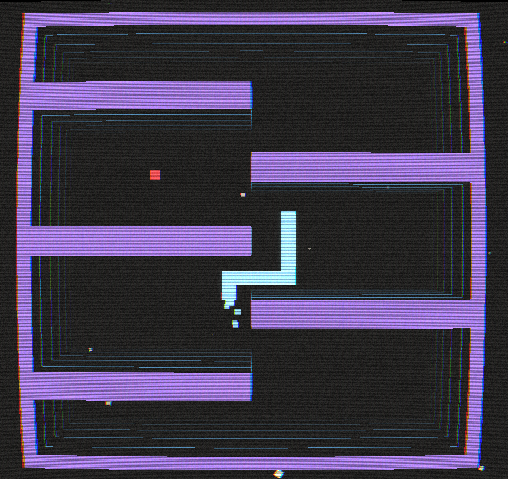

# Rosario - Devlog - 2

## Table of Contents
1. [Design Week Barcelona](#21---design-week-barcelona)
2. [The Walls Have Eyes](#22---the-walls-have-eyes)

<br>
<br>


# 2.1 - Design Week Barcelona
While developing `V1` and leaving a long trail of logs behind, a collection of different design ideas and possibilities piled up. Some of them more complex and more in need of further conceptualization, some derivative from other past projects of mine, but all in all a series of ways for thinking about twisting the original *Snake* foundations that the *nibbler/rosario* builds on. All of this aside, given the time constrains for this first incursion into `V2`, the design ideas of choice need to be selected with practicality in mind, all while also trying to pick them up with a showcasey mindset in mind. I think that in a past `V1` log I mentioned that my way of thinking about this *classic*, well rounded games was to break them appart into their basic elements and try to build on them. That's what I did with *Pong*, and what I'm aiming to keep doing in this first implementations. So, going back to *Snake*, it's core ingredients can be listed as:
- The `walls`
- The `snake`
- The `food`

On top of which we can also add some formal/material elements, somewhat superimposed, maybe a little bit meta, like:
- The representation paradigm (`2D`, `3D`)
- Some `textual` overlay
- The `UI`

We'll focus mainly in the first list, both because prototyping a couple of ideas in those 3 fronts in my current time frame seems doable. The first of the second tier, the aim to tie the visual mode with the mechanic layer of the game experience would also be great if it ended up included in the first prototype, but I fear that time is against me in this one, as it needs an overall rethinking about how the `3D` snake will work (I have some thoughts about it, but they are not *simple* ones, in the sense of their implementation). I'll try, nevertheless, and we'll see how it goes. And in this line, I might as well get right into it, straight to the first item of the first list, and work with the `2D` visualization wall elements. 

<br>
<br>

# 2.2 - The Walls Have Eyes
The first gameplay twist will be taken from my *Pong* game engine, as I think it translates perfectly to the `2D` realm of `V2`. The basic idea is to have **morphing walls**: having them move, grow, enclose the snakes progressively, reducing the game arena, blocking some paths, etc. The visual foundation for this is already in place: **the white walls and the animated tunnel-effect, background lines**. The walls and their transformation will mark the current area of the game, the safe places for the snakes, while the lines will *"announce"* their change. Moreover, and still in the same line as that mentioned *Pong*, these changing obstacles can be implement in (at least) two ways: **transforming walls** and **spawning obstacles**. Something about which a couple of images would explain far more and better than me keeping writing my way into your brain:


From here, the porting of these mechanics needs to take into account how the rendering and overall game management is done in this new, `C++` based engine that I've been building. Back there, in *Pong*, I remeber this process to be quite difficult, but the second time should be easier, right? R I G H T ? ? ? Well, we'll see. Some steps/doubts/general-ideas from the top of my head that sound important to lay out before diving into coding:
- The `WALLS` side:
	- Making the walls grow in a *snake* game, which is navigated (at least in this one, right now) orthogonally, calls for some building/visual organization to sanily tie how walls are built and how they grow. In less cryptic words, how the walls are drawn is going to need to change: **from a 4 rectangle based wall construction to a square-based layout**. Even more basically: **we'll now draw walls with square bricks**. 
	- Why `bricks`? Because we want to link everything to the same managing unit: a wall brick, a snake segment, a food pip, ... Everything should be based on squares to avoid interaction issues down the line.
	- Furthermore, **the bricks should be sized with divisable magnitudes** to layout the less painful possible ground for animation. Think about a wall that triggers a one brick worth of growth in some of it's points, like a lump. Said lump would be announced by a previous, gradual growth in the background tunnel lines, which will lerp it's formation during the spawn time. Say that that lump takes 8 background lines to completely form, each of them making the wall lump itself, the solid, white and collisionable one, slightly form. Therefore, having the square be divisable by 8 is paramount. We can start with `64x64` sized bricks.
- The `Tunnel Lines` side:
	- The lines that announce changes are going to need some rework to be able to be finely manipulated. Again, at this point they're drawn with `Raylib` line rendering functions, but they're going to have to be split into units to be able to twist, grow and transform.
	- What this means, also, is that the `TunnelLine` struct that I've been working with is going to need some (re)development, maybe even a transformation into its own class.
	- Everything will be manually managed with coordinate tracing, but I'll try my best to automate the new processes as much as possible.

Let's get to work!

The first and instantaneous instict is a realization: I have to move from whole, basic rectangle-draw-called walls to modular ones. But that's (obviously) not all, I'm going to have to (re)build a way to track the state of the walls, extensible to non-wall obstacles, so that the engine knows how to draw every state, as well as track said states to know were the snakes are allowed to move and what means death. Its complexity on complexity, so my best idea right know is to write some kind of `arena` class that tracks the state of the game field in a 2D collection of squares, useful both for rendering and for collision checking.

> This is going to be *some* work, but the core of my immediate fear lies on how this new way of tracking the game space is going to affect my AI pipeline. Bracing for impact Y_Y

> *a few hours later*

Yeah, I could have not been more mistaken in my thoughts about the tunnel lines stuff. The new grid tracking system, the wall deformations and the outline-to-tunnelline pipeline has surely been one of the most difficult things that I've had to code to date. It took quite some time and endlessly hitting a lot of walls until everything clicked in place and basically worked, at which point I broke into tears and thanked whatever god took pitty on me and guided my hands during the final edits. The whole working process went through this steps/items:
- Move all the cell status of the game arena/grid to an actual 2D mapping of cells, for which a new `Arena` class was created
- Go from a direct, rectangle-rendering-function-calling pipeline to draw walls to a general rendering pipeline that reads the arena grid's cell types and draws (or doesn't) squares accordingly.
- Have all the managing functions which had behaviours dependent on the type of the targeted cells transition into an Arena-based handling
- Write an outline algorithm to detect the points of the polygonal form that encloses the empty space in the arena.
	- In a default state, said polygon is a rectangular shape, as the walls are just made of 4 rectangular strips.
	- But if a wall grows lumps, distorts, transforms, ... The Outline starts to have more complex shapes, so being able to traverse the 2D grid arena information to detect the corners of it's empty space outline was extremely tricky.
- A general refinement of how food spawns and AI pathfinds to avoid walls and obstacles, no matter their configuration (again, via reading the grid data).

Way, way easier to write in words than in code, so let's break down things bit by bit.

<br>

### Snake 2: On the Beach
*Arena... Sand... I recently played through the second Death Stranding... yeah...*. The limit I had up to this point was that walls were just four plain rectangles, all around a brittle system that basically had to guess what was wwhere in the game. The best idea that I could come up with for a redirection was to transition into a **Cell-based grid**, with each cell being tagged with a `CellType`. By adding an `Arena` object to the `GameStatus`, I gained the ability to check the grid's cell statuses at any given moment, which in its turn allowed for a **CellType based managament of behaviors**. The new class has this current layout:
```cpp
#pragma once
#include "Renderer.hpp"
#include <vector>
#include <map>
#include <set>

enum class CellType {
	Empty,
	Wall,
	Obstacle,
	Snake_A,
	Snake_B,
	Food
};

enum class WallPreset {
	InterLock1
};

class Arena {
	private:
		std::vector<std::vector<CellType>> grid;
		int gridWidth;
		int gridHeight;
		int squareSize;

		Vector2 foodPosition;

	public:
		Arena(int width, int height, int squareSize); // W and H are in amount-of-squares magnitude
		~Arena() = default;

		// Grid manipulation (uses game coordinates: 0 to width-1, 0 to height-1)
		std::vector<std::vector<CellType>> getGrid() const;
		void setCell(int x, int y, CellType type);
		CellType getCell(int x, int y) const;
		bool isWalkable(int x, int y) const;
		void setFoodCell(int x, int y);
		Vector2 getFoodPosition() const;
		const std::vector<Vec2> getAvailableCells() const;

		// obstacle management
		void spawnObstacle(int x, int y, int width, int height);
		void transformWallWithPreset(WallPreset preset);
		void growWall(int x, int y, int width, int height);
		void clearCell(int x, int y);
		void clearArena();

		// outline extraction for tunnel lines
		std::vector<Vector2> getArenaOutline(int offsetX, int offsetY);

		// rendering
		void render(const Renderer& renderer) const;
};
```

> The wall preset stuff, let's ignore it for now, that's WIP

Some notes regarding the change:
- The grid is stored with a **1-cell-thick wall border on all sides**. This means the playable area is always safely enclosed, and out-of-bounds errors are much less likely. The counterpoint (the T O L L)  is that this means a lot of +1/-1 headaches when trying to work with the grid. *Las gallinas que entran por las que salen*.
- **Game coordinates** (what the rest of the code uses) are always (0,0) to (width-1, height-1). **Grid coordinates** (what the grid uses) are (1,1) to (width, height), whith the border at 0 and width + 1, etc. That's were existing in the space between the game and its greed becomes an act of pure bravery, but here we are.
- Everytime there needs to be a grid access, then, coords need to be increased by one. The opposite happens when a position wants to be returned from the grid, which needs a substraction of one. Safe and consistency against annoyance and loathe. Life is about choices.
- All of this matters because **every cell is now tracked**. No more "implied" walls or obstacles. If a game cell and its visual representation is a wall, that's because it is a wall in the grid. Same for empty cells. This adds a lot of robustness to rendering, physics management, AI logic and everything that's to come that will need to work with the grid.
- There's also the modularity angle, as now walls, obstacles, food, snakes and, again, anything that may be coming our way during the game design is/will be just different cell types in the same grid. With this, the game engine feels way ymore flexible, and while this also means that every system has now to play by the same rules, they are *bound* by them too. adding coherence and ease of inter-communication.

### "To Grow Is To Change" (—The game's walls, *probably*)
The idea of transformable walls, which is derived from what I did in *Pong*, is implemented in more than one way. Right now, I want this to be both something that *works*, that gives me at least the same gameplay implementation possibilities I had in that *Pong*, and that becomes a design experimentation tool. Therefore, I wrote both a targetting growth function and a preset based pipeline.
```cpp
void Arena::growWall(int x, int y, int width, int height) {
	// Check if starting position is valid in game coordinates
	if (x < -1 || x >= gridWidth - 1 || y < -1 || y >= gridHeight - 1) {
		std::cout << "error: wall growth: anchor out of bounds!" << std::endl;
		return;
	}

	if (getCell(x, y) != CellType::Wall) {
		std::cout << "error: wall growth: base node was not a wall!" << std::endl;
		return;
	}

	int xStep = (width >= 0) ? 1 : -1;
	int yStep = (height >= 0) ? 1 : -1;

	// Grow from the anchor position
	for (int i = x; i != x + width + xStep; i += xStep) {
		if (i < -1 || i >= gridWidth - 1) continue;
		for (int j = y; j != y + height + yStep; j += yStep) {
			if (j < -1 || j >= gridHeight - 1) continue;
			setCell(i, j, CellType::Wall);
		}
	}
}
```
- The function `growWall(x, y, width, height)` lets me grow a wall region starting from (x, y) in game coordinates, in the direction and size specified by width and height.
	- It checks that the anchor cell is already a wall (so we don't grow walls out of thin air), and then fills in the new region, updating the grid as it goes.
	- This is how we get those "lumps" and dynamic wall growths. The function handles all the bounds checks and only grows from existing wall anchors.

> Preset based wall transformation is, again, WIP, so I'll come back to it once done, probably in the next devlog, but the idea is to generate shapes like this:



Obstacles work in a similar way as the targetted wall growths: an anchor point and some direction values to know how to shape them (right now, only rectangular obstacles are supported, enhancements coming soon). The main difference between `obstacles` and `wall growths` is that the former are dettached from any wall, while the latter are always extension of the default walls (check the two *Pong* screenshots from above to get the gist).

<br>

### Relocation Reworkation
As I mentioned before, everything (well, at least almost everything) is now handled through the grid:
- Food is now placed only in truly empty cells. The function `getAvailableCells()` returns a list of all empty cells in the playable area (excluding the border walls).
- When food is eaten, we pick a random cell from this list and place the food there. This guarantees that food never spawns inside a wall, obstacle, or snake.
- The +1/-1 dance is crucial here: the list is built in grid coordinates, but returned in game coordinates, so everything lines up.

One particularly spicy part here was the grid tracking of the always moving snakes. Every time a snake moves, the snake-type cells need to be revised, taking into consideration if the snake is in the process of growing (to know if the cell occupie by a tail will be empty after the movement or stays snake-y). At first, *true to myself*, I went straight into what I can only describe as **truth juggling**: what do the snake objects say about what spaces are they occupying, what the grid *knows* is occupied by snakes, ... Who commands over who? Well, the answer couldn't be more simple: no one! Things are, oh surprise, way more simpler than that, because changes only really happen regarding the **head** and the **tail** of the snakes, so the work is really based around tracking those and their changes:
- Each snake segment is tracked in the grid as its own cell type (`Snake_A` or `Snake_B`).
- When a snake moves, it updates the grid: the new head is set, and the tail is cleared if the snake didn't grow.
- This makes collision detection and rendering much simpler: just check the grid.

> I guess this makes the grid the unique source of truth regarding what is what and where and when in the game?

### The O U T L I N E (or El Chico de la Curva)
If you're not spaniard or from south america you might not know what the hell this title is about. Very quickly: an urban legend about a ghost you can find in some dangerous roads, with lots of curves, that hitchhikes and when in your car tells you hey this is the curve where I died and then disappears and then, well, you die I guess. Point is: coming up with an outline detecting function/algorithm and translating it to what I was using as tunnel lines for the background animated effect was where I died. It's just that after dying I resurrected and that's why I'm back here, writing this, coding that, unable to escape the spriraling existence of life in this world.

Anyway, this was HARD, I'll repeat it as many times as I want, I EARNED IT. This is the jewel of my crown:
```cpp
std::vector<Vector2> Arena::getArenaOutline(int offsetX, int offsetY) {
	struct IVec2 {
		int x, y;
		bool operator<(const IVec2& o) const { return x < o.x || (x == o.x && y < o.y); }
		bool operator==(const IVec2& o) const { return x == o.x && y == o.y; }
	};

	auto isWall = [&](int c, int r) -> bool {
		if (r < 0 || r >= gridHeight || c < 0 || c >= gridWidth) return true;
		return grid[r][c] != CellType::Empty &&
			grid[r][c] != CellType::Food  &&
			grid[r][c] != CellType::Snake_A &&
			grid[r][c] != CellType::Snake_B;
	};

	// Build directed edge map, cancelling edges that are written twice
	// (two adjacent empty cells sharing a boundary = interior edge, not outline)
	std::map<IVec2, IVec2> next;
	std::set<IVec2> cancelled;

	auto addEdge = [&](IVec2 a, IVec2 b) {
		if (cancelled.count(a)) return;
		if (next.count(a)) {
			// Conflict: two cells want to write this edge — it's an interior edge, cancel it
			next.erase(a);
			cancelled.insert(a);
		} else {
			next[a] = b;
		}
	};

	for (int r = 0; r < gridHeight; r++) {
		for (int c = 0; c < gridWidth; c++) {
			if (isWall(c, r)) continue;
			if (isWall(c,   r-1)) addEdge({c,   r  }, {c+1, r  });
			if (isWall(c+1, r  )) addEdge({c+1, r  }, {c+1, r+1});
			if (isWall(c,   r+1)) addEdge({c+1, r+1}, {c,   r+1});
			if (isWall(c-1, r  )) addEdge({c,   r+1}, {c,   r  });
		}
	}

	if (next.empty()) return {};

	IVec2 start = next.begin()->first;
	for (auto& kv : next)
		if (kv.first < start) start = kv.first;

	std::vector<Vector2> outline;
	IVec2 prev = start;
	IVec2 cur  = next[start];
	int limit  = (int)next.size() + 2;

	while (!(cur == start) && --limit > 0) {
		IVec2 nxt = next[cur];
		int dx1 = cur.x - prev.x, dy1 = cur.y - prev.y;
		int dx2 = nxt.x - cur.x,  dy2 = nxt.y - cur.y;
		if (dx1 != dx2 || dy1 != dy2) {
			outline.push_back({
				static_cast<float>(offsetX + cur.x * squareSize),
				static_cast<float>(offsetY + cur.y * squareSize)
			});
		}
		prev = cur;
		cur  = nxt;
	}
	// Check start corner
	if (!outline.empty()) {
		IVec2 nxt = next[start];
		int dx1 = cur.x - prev.x,   dy1 = cur.y - prev.y;
		int dx2 = start.x - cur.x,  dy2 = start.y - cur.y;
		if (dx1 != dx2 || dy1 != dy2)
			outline.push_back({
				static_cast<float>(offsetX + start.x * squareSize),
				static_cast<float>(offsetY + start.y * squareSize)
			});
	}

	return outline;
}
```
- This function walks the grid, finds the boundaries between empty space and walls/obstacles, and builds a list of corner points (in screen coordinates) that trace the outline of the playable area.
- It does this by building a directed edge map: for each empty cell, it checks its four neighbors. If a neighbor is a wall/obstacle, it adds an edge. If two adjacent empty cells share a boundary, that edge is cancelled out (it's interior, not outline).
- After building the edge map, it walks the outline, collecting the corner points. This was a pain to get right, but it works even for crazy, non-rectangular shapes. And it looks super good, if I may add it myself, when connected to the animated tunnel effect.
- The tunnel lines themselves are now based on the outline points, used to generate the effect, which can now morph and twist to match any arena shape, including protrusions, dents and dynamically growing walls.
	- This is something that *Pong* wasn't able to do. There, everything was based on presets, so the growing patterns where very controlled. Also, back there only two walls existed, top and bottom, and the effect was done without a real perspective. In this new implementation design, the lines are both based on a rectangular based (i.e., four walls) and are fugued in a perspective like manner, with the fugue point in the center of the arena. That was once again turbo-painful, but I ended up with this function to calculate the insets of the pre-detected empty space outlines:
```cpp
std::vector<Vector2> AnimationSystem::calculateInsetShape(const std::vector<Vector2>& outerShape,
                                                           const Vector2& center,
                                                           float insetRatio,
                                                           float maxInsetPixels) const {
    if (outerShape.empty()) return {};

    // Find the average distance from center to outline points
    // This gives us a stable reference to convert pixel inset → scale factor
    float avgDist = 0.0f;
    for (const Vector2& point : outerShape) {
        float dx = point.x - center.x;
        float dy = point.y - center.y;
        avgDist += std::sqrt(dx * dx + dy * dy);
    }
    avgDist /= static_cast<float>(outerShape.size());

    if (avgDist < 0.001f) return outerShape;

    // minScale: how far in (as a ratio of avgDist) the inset is allowed to go
    float minScale = std::max(0.0f, (avgDist - maxInsetPixels) / avgDist);

    // Lerp between minScale (spawn) and 1.0 (at outline) using the same scale for ALL points
    float scale = minScale + (1.0f - minScale) * (1.0f - insetRatio);

    std::vector<Vector2> insetShape;
    insetShape.reserve(outerShape.size());

    for (const Vector2& point : outerShape) {
        float dx = point.x - center.x;
        float dy = point.y - center.y;
        insetShape.push_back({
            center.x + dx * scale,
            center.y + dy * scale
        });
    }

    return insetShape;
}
```

I could not, for the love of everything sacred, list all the approaches I tried to this calculations. Some of them gave me wrong inset shapes, some other didn't correctly manage bumps and dents, a good bunch also produced weird perspectives. But everything seems to have ended in a good spot. This too, as tey say, passed. And now I'm free to keep implementing new gameplay stuff (**looks nervously to the Nth refactoring bullet point in the the to-do list*)

 