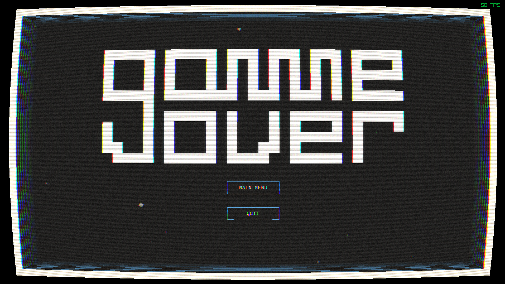
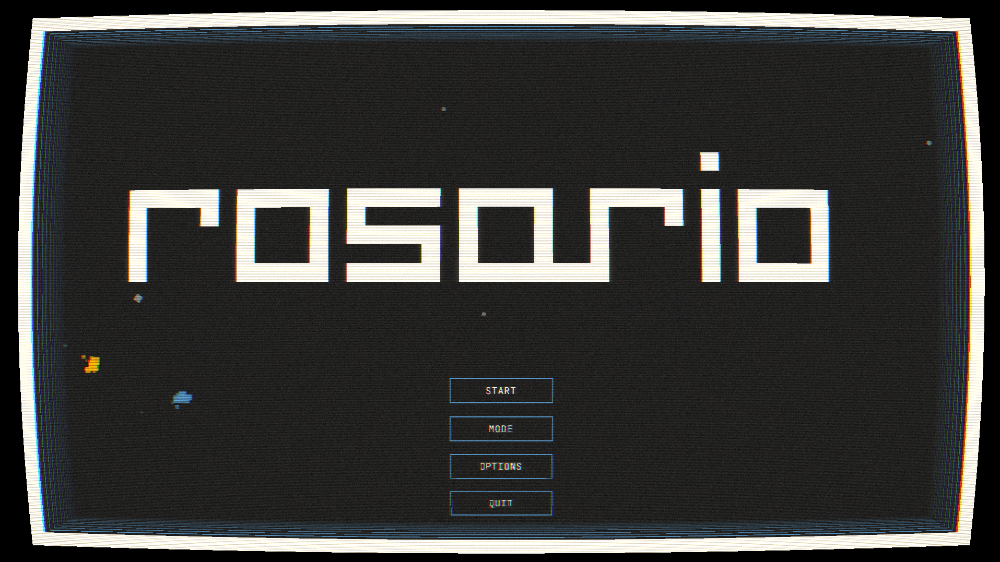
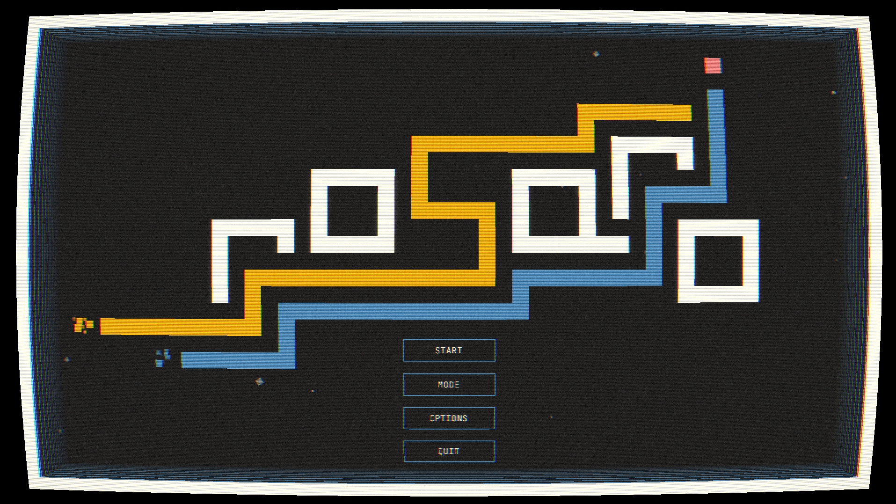
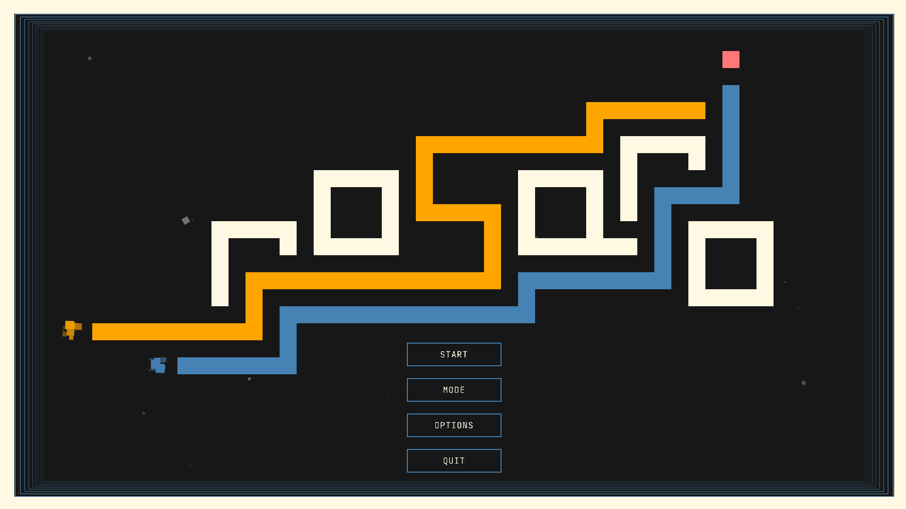

# Rosario - Devlog - 5

## Table of Contents
1. [Deep in Portlandia](#51---deep-in-portlandia)
2. [Keyboard-Hooking the Mouse-Hooked Menu Navigation](#52-keyboard-hooking-the-mouse-hooked-menu-navigation)
3. [Fun With Squares](#53-fun-with-squares)
4. [From Plan to Pipeline](#54---from-plan-to-pipeline)
5. [What Now, After So Much](#55---what-now-after-so-much)

<br>
<br>

# 5.1 - Deep in Portlandia
This is the log where porting ends. Most of it is already done, but the following are still pending, all menu related:
- [x] Keyboard co-navigation of buttons
- Logos (for which I wanted a dedicated pipeline)
- More particles in the start menu
- A way to display extra info both in Start (current mode) and GameOver (score/results)

Besides that, the OOP version had a food-eating -> arena-changing chain of effects, but it was very placeholder-heavy. I am treating that as the first development step after porting, not as porting itself. In other words, this is the starting point for the next phase: full ECS + data-driven development.

<br>

# 5.2 Keyboard-Hooking the Mouse-Hooked Menu Navigation
Back in OOP, mouse menu navigation was optional, not mandatory. We needed the same behavior in the current build:
- Up/Down arrows to navigate buttons and update hover state
- Enter to click buttons (same behavior as left mouse click)
- Cyclic selection (moving past last returns to first)

This is now wired in ECS as one interaction flow, not two competing ones:
- Every frame in Menu and GameOver, main calls `UIInteractionSystem::update(registry, eventQueue, activeMenu)`
- `activeMenu` is explicitly passed (`ButtonMenu::Start` or `ButtonMenu::GameOver`), so only relevant buttons are considered
- The system builds a deterministic candidate list by filtering by menu and sorting by `ButtonConfig.index`

Behavior summary:
- `Down` / `S`: move hover forward
- `Up` / `W`: move hover backward
- No current hover + `Down`/`S`: select first button
- No current hover + `Up`/`W`: select last button
- Wrap-around remains enabled
- `Enter` / `Numpad Enter`: dispatches the same `ButtonClicked` event path as mouse clicks

Mouse coexistence:
- Keyboard-selected hover persists while the mouse is idle
- Mouse movement or click takes hover ownership for that frame
- Left click dispatches `ButtonClicked` exactly as before
- Non-active menu buttons have hover cleared to prevent cross-menu leakage

Small UX alias in Start menu mode cycling:
- `Left`/`Right` and `A`/`D` trigger the `modeChange` action directly
- Hover is moved to the mode button for visual coherence

Keyboard and mouse now co-navigate the same ECS button state instead of competing through separate paths.

<br>
<br>

# 5.3 Fun With Squares

The last major missing piece in the new version was the custom square-based text pipeline for logos and UI headings. In the old OOP build, this area had become fragile:
- hardcoded coordinates
- manual positioning per word
- inconsistent spacing rules
- no clean way to scale to additional text elements

So this was not a direct "OOP copy into ECS" step. It became a full redesign, with a strict goal: integrate text rendering into the same architectural rules as the rest of the project.

## 5.3.1 Design Objectives

The new pipeline needed to satisfy all of this:
1. Follow ECS and data-driven principles end to end
2. Keep visual behavior deterministic across resolutions
3. Avoid hardcoded text-specific rendering branches
4. Support both static branded text and general short UI strings
5. Fail safely when JSON is invalid or partially missing

## 5.3.2 Scope of Use Cases

Target use cases for this implementation cycle:
- branded text (`ROSARIO`, `GAME OVER`)
- reusable custom font behavior for short UI strings
- menu-only rendering (2D UI states first)
- configuration from JSON, not from code constants

Non-goals for this cycle:
- in-world 3D text
- rich typography system with kerning tables
- animated style themes (planned but deferred)

## 5.3.3 Data Model

The pipeline uses two main JSON sources.

### A) Glyph Library JSON
Defines the square-grid font itself:
- global metrics (`cellSize`, default spacing)
- per-glyph cell coordinates
- per-glyph metrics (`advance`, optional bearings)
- support for both normal char IDs and named glyph IDs

Example shape:

```json
{
  "cellSize": 8,
  "letterSpacing": 1,
  "lineSpacing": 2,
  "capHeightCells": 2,
  "lineGapCells": 1,
  "glyphs": {
    "g": {
      "cells": [2, 1],
      "advance": 6,
      "bearingY": 2
    },
    "g_logo": {
      "cells": [3, 2],
      "advance": 7,
      "bearingY": 3
    }
  }
}
```

### B) Glyph Presets JSON
Defines text entries and rendering intent:
- text content
- position
- scale
- color
- centering flags
- state visibility
- optional overrides and ligatures

Example shape:

```json
{
  "gameover_title": {
    "text": "GAME OVER",
    "position": [640, 180],
    "scale": 2.0,
    "color": [255, 255, 255, 255],
    "centerX": true,
    "visibleInStates": ["GameOver"]
  }
}
```

## 5.3.4 ECS Components and System Split

The implementation is intentionally split in two components:

```cpp
struct PixelTextComponent {
    std::string id;
    std::string text;
    Vector2 position {0, 0};
    float scale = 1.0f;
    Color color = {255, 255, 255, 255};
    std::unordered_map<size_t, std::string> glyphOverrides;
    std::unordered_map<size_t, GlyphLigatureOverride> glyphLigatures;
    std::vector<GameState> visibleInStates;
    bool centerX = false;
    bool visible = true;
};

struct PixelTextLayoutComponent {
    std::vector<LayoutQuad> quads;
    bool dirty = true;
};
```

Responsibilities:
- `PixelTextComponent`: declarative intent (what should be shown)
- `PixelTextLayoutComponent`: computed geometry cache (how it is drawn)

System split:
- `PixelTextLayoutSystem`: builds quads only when dirty
- `PixelTextRenderSystem`: draws quads in UI phase
- loader modules: parse JSON into structs

This keeps rendering simple and layout deterministic.

## 5.3.5 Milestone Plan

Milestone 1:
- one glyph library
- one preset
- one state (`GameOver`)
- verify vertical slice end to end

Milestone 2:
- support `menu_logo`
- add scaling and centering
- state visibility management

Milestone 3:
- glyph overrides
- ligature support
- line-break edge cases

Milestone 4 (future):
- style themes
- animation tags
- extra caching/polish

## 5.3.6 Validation Criteria

Throughout development, these constraints were non-negotiable:
- stable spacing at all scales
- no frame flicker from dirty/layout mismatch
- predictable layer ordering in UI phase
- graceful handling of bad JSON
- no stale entity access after registry reset

<br>
<br>

# 5.4 - From Plan to Pipeline

The pipeline is now fully working in the current build: JSON config -> ECS components -> layout pass -> UI rendering pass.



Implementation was not linear. As soon as the first vertical slice worked, real engine-level issues appeared: entity lifetime across registry resets, coordinate-space mistakes, override precedence, ligature behavior, and composition alignment. Having the custom "text" pipeline work with base glyps and with custom ones (via override and ligatures) was, quite frankly, a very hard thing to code for me. It ended up working quite well, but until I reached the current point buckets of sweat and tears were filled to the brim. I also spent some time designing a temporary logo for the game using the new pipeline, which also took a big chunk of my (weekend) time, but that was fun. Drawing things is nice. And now we have a fancy logo (that I still need to decide if I like, both regarding the approach and the result, so we'll see). 

<br>

## 5.4.1 Vertical Slice in Code

The first objective was narrow and deliberate: render one JSON-defined title in one state.

Minimal flow:
1. Load glyph library + presets
2. Spawn a pixel text entity
3. Compute layout quads
4. Render quads during UI phase

Initialization pattern:

```cpp
GlyphLibrary glyphLib = GlyphLibraryLoader::load("data/GlyphLibrary.json");
GlyphPresetLoader::PresetTable glyphPresets = GlyphPresetLoader::load("data/GlyphPresets.json");

PixelTextComponent gameOverTitleTemplate = makeGameOverTitleTemplate(glyphPresets);
Entity gameOverTitle = Factories::spawnPixelText(registry, gameOverTitleTemplate, true);
```

Per-frame integration:

```cpp
pixelTextLayoutSystem.update(registry, glyphLib);
pixelTextRenderSystem.render(registry);
```

That gave a complete end-to-end slice with minimal moving parts, one that if you've been reading this logs until this point *(who are you??? Why are you doing this????)* you'll see that is nothing really new in the great scope of this project's things. There is JSON data, a data loader that converts the config data into code-sided struct data, and a couple of systems with update public entry points that are fully based on `Registry` queries (i.e., they work on entities with targeted components, i.e. wer'e still full ECS quality cuties). Obviously, how things work below that is its own can of worms, and a particularly big one and full of a lot of juicy squiggly creatures, but that's what we're here for, right? Let's just keep adding 5.4.x sections until the full pcture is drawn.

<br>

## 5.4.2 Loader Behavior and Extensibility

The two loaders follow the same contract style as other systems in the project:
- parse JSON
- validate required fields
- convert to strongly typed structures
- throw on malformed data

As previously mentioned, there are particularities regarding the loading of this particular data sets, as they are configured with diferent possibilities depending on what fields are present in the JSON and, obviously, their contents. With this I mean that a data set for the `rosario` logo, for example, could have glyph overrides and ligatures and color substitutions, but they're not structurally *required* for the loading to succeed. This extensible/mutable behavior was tricky to nail, but in the end it's really just based in content checks. Preset parsing, therefore, goes through those checks, so that config data set up in `GlyphPreset.json` and the contents (regular and overriden "characters") specified in the `GlyphLibrary.json` can meet each other down the loading line. Generally speaking, what this returned was a **per-preset customization without the need for hardcoded string branches**, an extremely important goal in the data-driven sphere of things.

```cpp
if (entry.contains("glyphOverrides") && entry.at("glyphOverrides").is_array()) {
    for (const auto& override : entry.at("glyphOverrides")) {
        size_t index = override.at("index").get<size_t>();
        std::string glyphId = override.at("glyph").get<std::string>();
        preset.glyphOverrides[index] = glyphId;
    }
}

if (entry.contains("glyphLigatures") && entry.at("glyphLigatures").is_array()) {
    for (const auto& ligature : entry.at("glyphLigatures")) {
        size_t index = ligature.at("index").get<size_t>();
        GlyphLigatureOverride override;
        override.length = ligature.value("length", static_cast<size_t>(2));
        override.glyph = ligature.at("glyph").get<std::string>();
        preset.glyphLigatures[index] = override;
    }
}
```

<br>

## 5.4.3 Crash Fix: Registry Reset and Stale Entity IDs

While things started to work, things started to crash also. This is a classic: you touch this, expand that, and end up segfaulting. My custom logos were alive, but upon transitioning into game states or exiting an initial session, a bug showed it's tiny little feet through the cracks of the WIP build. Some time poured into its hunt, a couple of head-butts to the nearest wall and the following diagnostic arose:
- `GameManager::resetGame(...)` recreated the registry
- previously spawned text entities were destroyed
- later access used stale `Entity` IDs
- result: invalid component access / segfault

In other words: the newly created `Registry` after a state transition needed to refresh the text pipeline related entities. This was the trigger pattern:

```cpp
registry = Registry{};
registry.getComponent<PixelTextComponent>(gameOverTitle); // stale entity id
```

And the fix was one of those conceptually clear pathways that are somewhat difficult to land in a specific, clean code approach. I ended up implementing helpers, checkpoint functions that could ensure that there were no stale entities after a state transition. Basically, **a registry check for the necessary, custom-text entity**, so that if it persisted, it could be fetched, and if it was lost in the process, could be recreated. This avoided stale access after reset by providing an automatic recover of the text entities after registry wipes:

```cpp
Entity ensurePixelTextEntity(Registry& registry, Entity& entity, const PixelTextComponent& templateData) {
    if (registry.hasComponent<PixelTextComponent>(entity)
        && registry.hasComponent<PixelTextLayoutComponent>(entity)) {
        return entity;
    }

    entity = Factories::spawnPixelText(registry, templateData, true);
    return entity;
}
```

<br>

## 5.4.4 Spacing Fix: Cell Units vs Pixel Units

Another core layout bug caused overlapping glyphs, this one with a more straightforward cause: I was mixing unit measurements. This has been a somwehat constantly appearing problem during the port development (and in the OOP version, really), as sometimes I mix pixel-measurements with cell-measurements, the latter being themselves comprised of sums of pixels. This was the incorrect, initial mental model:
- `advance` in cells
- spacing in pixels
- mixed arithmetic in one expression without normalization

And, luckily, the fix was very easy, a straight forward normalization so that spacing remains stable at all scales:

```cpp
cursorX += ((advanceCells * cellPixel) + letterSpacingPixel) * text.scale;
```

- `advanceCells`: glyph horizontal advance in cell units
- `cellPixel`: pixel size per cell
- `letterSpacingPixel`: spacing configured in pixels

<br>

## 5.4.5 Special Glyph Overrides (Contextual Character Rendering)

Tricky stuff, not going to lie. I had to both set up a way to trigger the overrides and a way to handle them, so that a given data config set to write a specific word (say, "rosario"), could specificy something like "hey, use the special logo 'i' character instead of the regular one". So, a **same source text can require different visual glyphs inside the same preset**, and how to do this? Well, `JSON` gives you all the tools you need for the communication step, just insert a field that specifies the target of an override and the subtitution glyph, and then build the processing of the alternative to the loading process. More specifically:

```json
"glyphOverrides": [
  { "index": 0, "glyph": "g_logo" }
]
```
Paired with:
```cpp
if (entry.contains("glyphOverrides") && entry.at("glyphOverrides").is_array()) {
	for (const auto& override : entry.at("glyphOverrides")) {
		size_t index = override.at("index").get<size_t>();
		std::string glyphId = override.at("glyph").get<std::string>();
		preset.glyphOverrides[index] = glyphId;
	}
}
```
But, BUT, while working on this, and having hand-designed some logos both for the game title and the game over screen, I stumble on another of the mighty Specificity Stones: what if I want to have continuous, ligated letters? I had one in my render of "game over", and some of my main title experimentations were going through that path, and the glyph override wasn't going to work for these cases with the logic I had in place. For simple reasons: when overriding a character, the result was still *one* character, be its shape and position and playfulness and color what it may, but combining, say, an 'a' with an 'm' had an implicit step of converting, management wise, two characters into one. How to tackle this? Well, with another field, this one detailed in the next subsection, and an in place subtraction of one character. In a more practical way: from "game over" into "gae over", but with a sub-override type that visually (formally) converted the "am" into an "a"+"m". All together, the resolution priority in a layout pass ended up being, in search for determinism and full control of the order of substitutions:
1. ligature override at index
2. single glyph override at index
3. default char lookup

<br>

## 5.4.6 Ligature Layer for Connected Letters

As advanced, ligatures were signaled by their own `JSON` fields, which get translated into code structs that store the length of the ligature and the override glyph. This was needed in order to make a non-specific, scalable and open ligature process.

```json
"glyphLigatures": [
  { "index": 1, "length": 2, "glyph": "am_join" }
]
```

```cpp
struct GlyphLigatureOverride {
    size_t length = 2;
    std::string glyph;
};
```
The general behavior of this alternative substitution pipeline goes through these steps:
- if ligature exists at cursor index and does not cross line boundaries
- render replacement glyph once
- consume `length` source characters

With this, words maintain their general characteristics, and the user has full control of how they look by using the given tools to specifcy how they're shaped and generally taken into consideration when being translated from `JSON` into structs and logic. And on the configuration side, totally decoupled from code (and therefore from compilation et al.), any word or phrase sent through the special text pipeline just works in a default manner (given that the default glyphs are stored in the library; for now, I only have the ones I'm currently useing), which can be overriden in the two specified ways. Here's a comparison between a straight up "rosario" rendering and the logo version:

```json
{
      "id": "menu_logo",
      "text": "rosario",
      "x": 915,
      "y": 360,
      "scale": 1.8,
      "centerX": true,
      "color": [255, 248, 227, 255],
      "visibleInStates": ["Menu"]
    }
```


```json
{
      "id": "menu_logo",
      "text": "rosario",
      "x": 915,
      "y": 360,
      "scale": 1.8,
      "centerX": true,
      "color": [255, 248, 227, 255],
      "glyphOverrides": [
        { "index": 0, "glyph": "r_logo" },
        { "index": 2, "glyph": "s_logo" },
        { "index": 3, "glyph": "a_logo" },
        { "index": 4, "glyph": "r_logo_2" },
        { "index": 5, "glyph": "i_logo" },
        { "index": 6, "glyph": "o_logo" }
      ],
      "glyphColorOverrides": [
        { "index": 2, "color": [255, 165, 0, 255] },
        { "index": 5, "color": [70, 130, 180, 255] }
      ],
      "glyphCellColorOverrides": [
        {
          "index": 5,
          "cells": [
            { "x": -1, "y": -7, "color": [255, 120, 120, 255] }
          ]
        }
      ],
      "visibleInStates": ["Menu"]
    }
```



<br>

## 5.4.7 Some More Annoying Nuisances

With the pipeline fully working and the tools for customizing texts in place, a handful of details still needed to be handled: combinations of spaces and line breaks, horizontal and vertical advancements, centering and clean integration with the rest of the code. Most of this issues and their fixes are not interesting, but centering required its own `JSON` flag and a post-layout transformation:

```json
"centerX": true
```

```cpp
const float currentCenterX = (minX + maxX) * 0.5f;
const float deltaX = text.position.x - currentCenterX;
for (auto& quad : layout.quads) {
    quad.x += deltaX;
}
```

<br>

## 5.4.10 Main Loop Integration and State Visibility

The new text pipeline is state-scoped in the UI branch. The display of the logos/special words are handled depending on the state of the game (managed via the state machine), and their visibility runs through a helper function that reigns over all text entities:

```cpp
void applyPixelTextStateVisibility(Registry& registry, GameState state) {
    auto view = registry.view<PixelTextComponent, PixelTextLayoutComponent>();
    for (Entity e : view) {
        auto& text = registry.getComponent<PixelTextComponent>(e);
        auto& layout = registry.getComponent<PixelTextLayoutComponent>(e);
        const bool expectedVisible = shouldBeVisibleForState(text, state);
        if (text.visible != expectedVisible) {
            text.visible = expectedVisible;
            layout.dirty = true;
        }
    }
}
```

And after porting everything, the frame build process is solidified in the following 4 steps, which keep pixel text in their own, specific, ordered compositing stage:
1. world render
2. UI layout update
3. UI text render
4. post-processing present

<br>



<br>

# 5.5 - What Now, After So Much
At this point, the port can be considered done. There are a couple of things that need fixing, and the whole test suite needs to be redone, but that can be considered extra stuff. I'll focus on those, end the port logging and start a new when I'm ready to start experimenting with gameplay. Until then, nothing more on my side <3